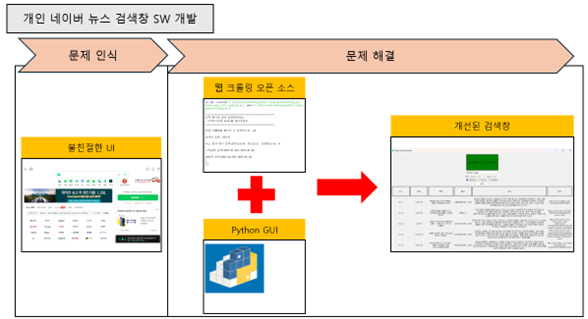
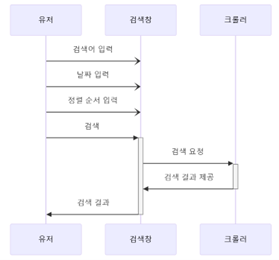
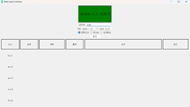
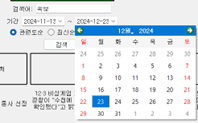
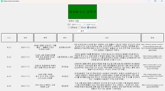

# naver_news_crawling_with_pythonUI

------
Used Source
-------------
Python을 이용한 네이버 뉴스 리스트 크롤링 프로그램 (naver news crawling)
https://github.com/sbomhoo/naver_news_crawling

------
 사용 라이브러리  
-------------
- BeautifulSoup
- requests
- pandas
- datetime
- requests
- PyQt5

-------
 프로그램 소개 
 -------------

--------
프로그램 개요
--------------

------
 실행 
-------------

